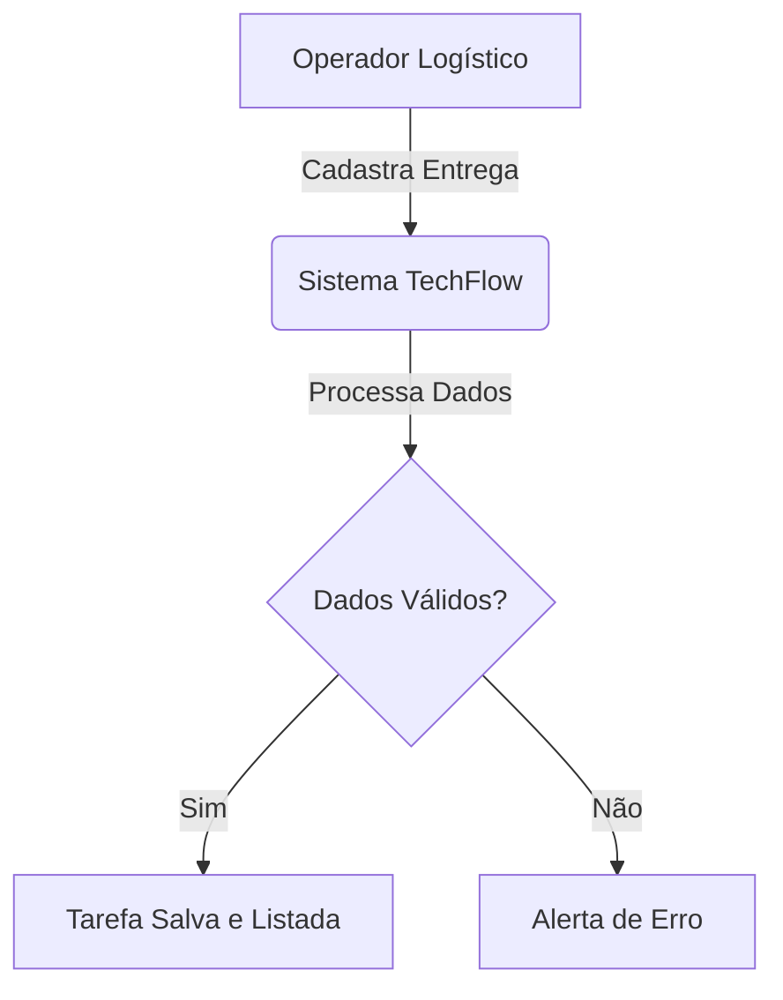

# TechFlow Logistics System

## 1. Sobre o Projeto
Este sistema foi desenvolvido pela **TechFlow Solutions** para uma startup de logística. O objetivo é gerenciar o fluxo de entregas em tempo real, garantindo priorização e eficiência.

## 2. Metodologia de Trabalho
Utilizamos o **Framework Scrum** com suporte visual do **Kanban**. 
- **Ciclo de Vida:** Iterativo e Incremental.
- **Gestão Visual:** Uso de quadro Kanban no GitHub Projects.

## 3. Arquitetura do Sistema (UML)

## 4. Engenharia de Requisitos (Unidade 2)
Para garantir que o sistema atenda às necessidades da startup de logística, definimos os seguintes requisitos:

### Requisitos Funcionais (RF)
* **RF01:** O sistema deve permitir a criação de novas tarefas de entrega.
* **RF02:** O sistema deve permitir a listagem de tarefas para acompanhamento.
* **RF03:** O sistema deve permitir marcar tarefas como concluídas ou atualizar status.

### Requisitos Não Funcionais (RNF)
* **RNF01:** O sistema deve garantir a integridade dos dados das tarefas.
* **RNF02:** O sistema deve possuir automação de testes (Garantia de Qualidade).
* **RNF03:** A interface deve ser simples e intuitiva (Usabilidade).

## 5. Gestão de Mudanças e Qualidade (Unidade 4)
Este projeto aplica conceitos de agilidade para lidar com imprevistos:

* **Simulação de Mudança:** Durante o desenvolvimento, identificamos a necessidade de incluir um campo de **'Prioridade'** nas entregas. Seguindo o Manifesto Ágil, essa mudança foi priorizada no Backlog e implementada sem impacto no cronograma.
* **Integração Contínua (CI):** Utilizamos o **GitHub Actions** para validar o código automaticamente a cada atualização, assegurando que o sistema esteja sempre funcional.

---
*Status do Projeto: Sprint 1 Finalizada com Sucesso.*
